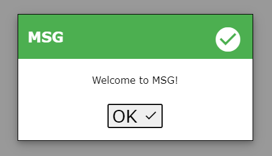
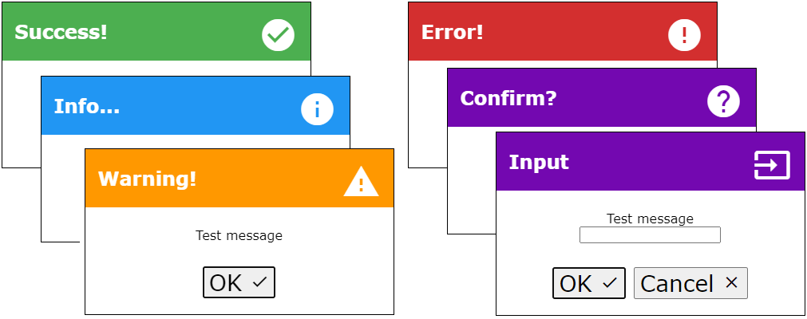

<p align="center">
    
</p>
<h3 align="center">MSG</h3>
<hr>
<p align="center">
  <a href="../../issues">Report an Issue</a>
  ·
  <a href="../../releases">Releases</a>
  ·
  <a href="/CHANGELOG.md">Change Log</a>
</p>
<p align="center">
  <a href="#Description">Description</a>
</p>
<hr>

## Description
MSG is a modal dialog box JavaScript library.

MSG is fully customisable, and has the following msg types:
- Success
- Info
- Warning
- Error
- Confirm
- Input
- Custom (any text other than the above is treated as custom)

### Types



Type | Description | Example |
---- | ----------- | ------- |
Success | To be used as a success/confirmative message | showMsg("success", "File saved!")
Info | To be used as a informational/informative message | showMsg("info", "Version 1.01")
Warning | To be used as a warning message (not error state) | showMsg("warning", "The file has not loaded yet")
Error | To be used as an error message | showMsg("warning", "Something went wrong processing your request")
Confirm | To be used as a confirmational dialog. User is presented with a yes/no OK/cancel button set to opt out. Callback functions can be passed through that are called onConfirm and onDecline respectively | showMsg("confirm", "Are you sure you want to delete this file?", fnOK, fnCancel)
Input | To be used to retrieve information from the end user. A callback function can be passed through to intercept the inputted value | showMsg("input", "Please enter a file name", fnFileName)
Custom | Mimicks the type success, but with custom text | showMsg("My new MSG type", "This is a custom message")

### Usage

To show a dialog message:
```js
showMsg("type", "my message");
```
Where type is one of the above values, and my message is the message to be shown.

For <i>confirm</i> types callback functions can be added for OK and Cancel button clicks:
```js
const onConfirm = function() {
    console.log("OK button clicked");
}
const onDecline = function() {
    console.log("Cancel button clicked");
}

showMsg("confirm", "my message", onConfirm, onDecline)
```

For <i>input</i> types callback functions can be added for OK and Cancel button clicks that will return the user added value:
```js
onConfirm = function(sender, value) {
    console.log("OK button clicked. Input was: " + value);
}

onDecline = function(sender, value) {
    console.log("Cancel button clicked. Input was: " + value);
}

showMsg("confirm", "my message", onConfirm, onDecline)
```

The following global variables can be set to customise the modal window:
Variable | Description | Default Value |
-------- | ----------- | ------------- |
MSG_HEADER_FONT | Sets the header font | Verdana, sans-serif
MSG_CONTENT_FONT |Sets the content font | Verdana, sans-serif
MSG_HEADER_FONT_COLOUR | Sets the header font colour | #FFFFFF
MSG_CONTENT_FONT_COLOUR | Sets the content font colour | #000000
MSG_CONTENT_COLOUR | Sets the main background colour | #FFFFFF
MSG_CONTENT_MAX_WIDTH |Sets the max width of the modal. Useful for using as instruction popups, etc. | 386px
MSG_SUCCESS_COLOUR | Sets the header colour when the msg type is success | #4caf50
MSG_INFO_COLOUR | Sets the header colour when the msg type is info | #2196F3
MSG_WARNING_COLOUR | Sets the header colour when the msg type is warning | #ff9800
MSG_ERROR_COLOUR | Sets the header colour when the msg type is error | #d32f2f
MSG_CONFIRM_COLOUR | Sets the header colour when the msg type is confirm | #7308B0
MSG_INPUT_COLOUR | Sets the header colour when the msg type is input | #7308B0
MSG_CUSTOM_COLOUR | Sets the header colour when the msg type is custom | #4caf50
MSG_TEXT_OK | Sets the main OK button text | OK
MSG_TEXT_CANCEL | Sets the cancel button text | Cancel
MSG_TEXT_CONFIRM_OK | Sets the main OK button text when the msg type is confirm | OK
MSG_TEXT_CONFIRM_CANCEL | Sets the main cancel button text when the msg type is confirm | Cancel
MSG_TEXT_SUCCESS | Sets the header text when the msg type is success | Success!
MSG_TEXT_INFO | Sets the header text when the msg type is info | Info...
MSG_TEXT_WARNING | Sets the header text when the msg type is warning | Warning!
MSG_TEXT_ERROR | Sets the header text when the msg type is error | Error!
MSG_TEXT_CONFIRM | Sets the header text when the msg type is confirm | Confirm?
MSG_TEXT_INPUT | Sets the header text when the msg type is input | Input
MSG_USE_ICONS | Defines whether to use icons or not (icon pack is Google's Material Icons) | true

See [here](https://github.com/tobybutchart/msg/blob/master/src/test-msg.html) for a more comprehensive example.
